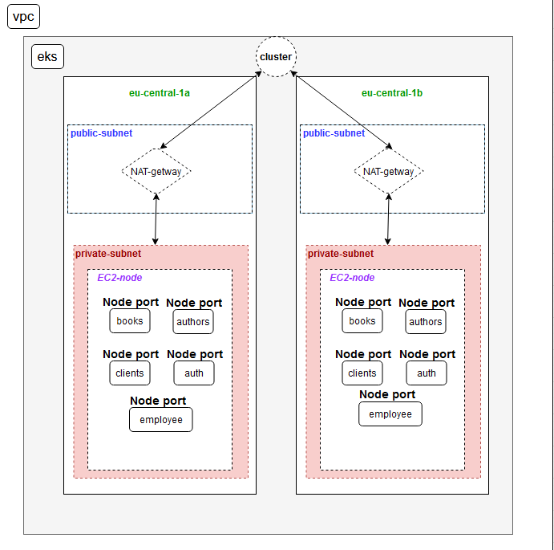
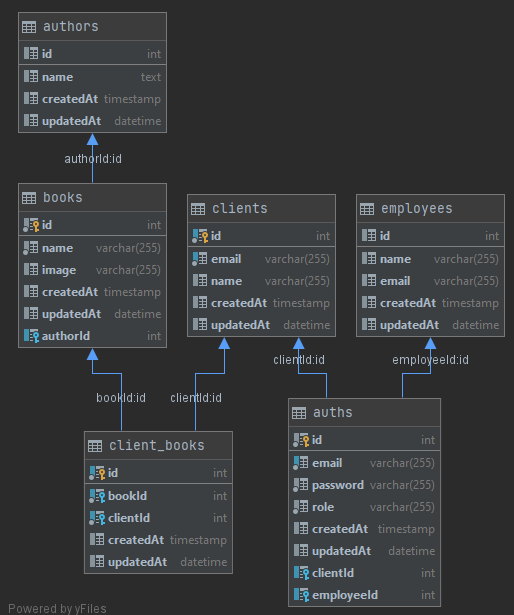

# Library

#### Example library project that run on AWS with eks (k8s)
##### micro-services are:
* clients - nodeJS
* employees - nodeJS
* books - nodeJS
* authors - nodeJS
* auth - nodeJS
* initialize - python

##### k8s base on:
* nginx-ingress (network-lb)
* helm charts 

##### aws diagram


##### DB
* mysql sitting on RDS




##### Locally
* How to run => base on docker-compose

```
docker-compose --env-file .env up
```


